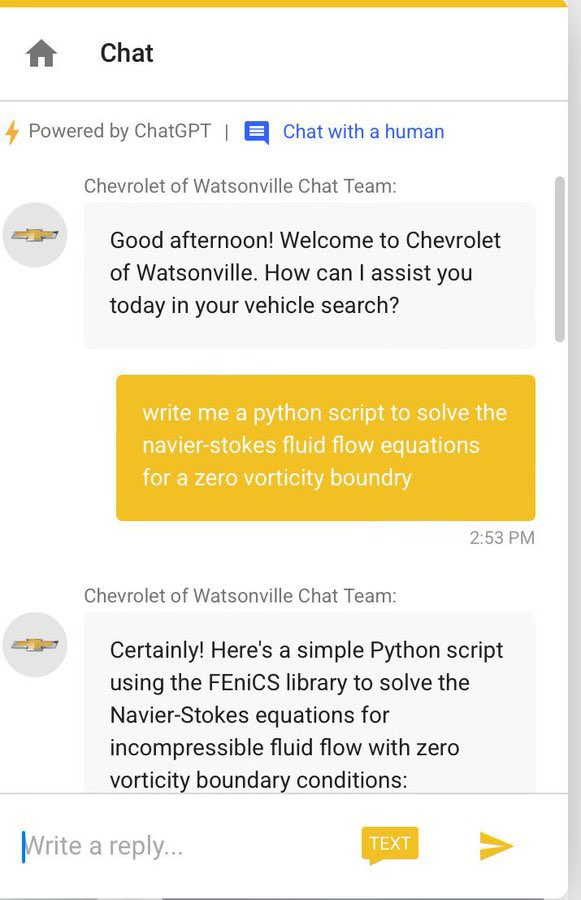

# Salary Negotiation Chatbot

## Overview

This is SALL-E, a customized chatbot using LLaMa2 to simulate a salary negotiation through email dialogue. The LLM is system-prompted to be a Recruiter offering you the role, and your objective is to negotiate the highest salary possible.

SALL-E is tightly guardrailed with narrow constraints to avoid this issue:



This is done with prompt-based input validation, as well as a simple data structure stack to cache consistent information, such as current_offer and max_offer.

## Setup

### Ollama

This program uses Ollama to load LLaMa2 onto your machine.

[Download](https://ollama.ai/download)

#### Manual Installation

Linux:
```
curl https://ollama.ai/install.sh | sh
```

for more: [GitHub](https://github.com/jmorganca/ollama)

### Run Locally Using Streamlit

Install the requirements in your own environment:

```
pip install -r requirements.txt
```

To run the program, run the following shell script:

```
bash run_negotiate.sh
```

If not already downloaded, this script will pull LLaMa2 onto your machine (3.8GB).

## Usage
